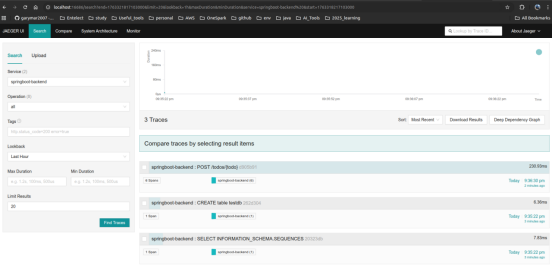
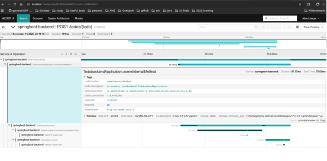
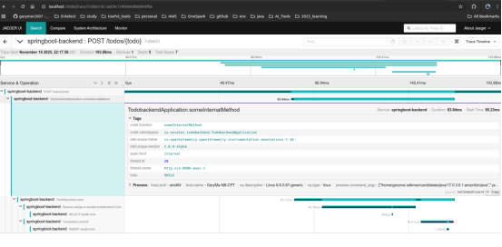

# OpenTelemetry Spring Boot Java and Flusk Python Instrumentation

## Automatic Instrumentation
Get the OpenTelemetry Java Agent

    wget https:‌//github.com/open-telemetry/opentelemetry-java-instrumentation/releases/download/v2.8.0/opentelemetry-javaagent.jar

Configure the OpenTelemetry Java Agent

    export OTEL_TRACES_EXPORTER=console
    export OTEL_METRICS_EXPORTER=none
    export OTEL_LOGS_EXPORTER=none

Run the application

    java -javaagent:./opentelemetry-javaagent.jar -jar target/todobackend-0.0.1-SNAPSHOT.jar

You will be able to see the logs and traces in the console.

In order to visualize the exported information, we can deploy Jaeger application, 
which comes with a bundled OpenTelemetry collector.

    docker run -d --name jaeger \
        -e COLLECTOR_OTLP_ENABLED=true \
         -p 16686:16686 \
         -p 14268:14268 \
         -p 4317:4317 \
         -p 4318:4318 \
         jaegertracing/all-in-one

To confirm that Jaeger is running in Docker, run the following command:

    docker ps

You should be able to see the Jaeger container running:

    CONTAINER ID   IMAGE                      COMMAND                  CREATED         STATUS         PORTS         NAMES
    65efd5788ad6   jaegertracing/all-in-one   "/go/bin/all-in-one-…"   7 seconds ago   Up 6 seconds   5775/udp, 5778/tcp, 9411/tcp, 0.0.0.0:4317-4318->4317-4318/tcp, 0.0.0.0:14268->14268/tcp, 0.0.0.0:16686->16686/tcp, 6831-6832/udp, 14250/tcp   jaeger

Open the Jaeger UI in your browser: http://localhost:16686/

To ensure the information will be sent to the right endpoint, reconfigure the environment variable from before:

    export OTEL_TRACES_EXPORTER=otlp
Additionally, configure the location of the Collector by specifying:

    export OTEL_COLLECTOR_HOST=localhost

Run the application again:

    java -javaagent:./opentelemetry-javaagent.jar -jar target/todobackend-0.0.1-SNAPSHOT.jar

Test the API: http://localhost:8080/todos/NEW

    curl -X POST localhost:8080/todos/NEW

You should see the trace in the Jaeger UI:

## Code-based Instrumentation for Java & Python
    docker run -d --name jaeger \
      -e COLLECTOR_OTLP_ENABLED=true \
      -p 16686:16686 \
      -p 14268:14268 \
      -p 4317:4317 \
      -p 4318:4318 \
      jaegertracing/all-in-one
Download the agent JAR file, if it is not there yet.

    wget https:‌//github.com/open-telemetry/opentelemetry-java-instrumentation/releases/download/v2.8.0/opentelemetry-javaagent.jar

    export OTEL_TRACES_EXPORTER=otlp
    export OTEL_METRICS_EXPORTER=none
    export OTEL_LOGS_EXPORTER=none

In order to make someInternalMethod observable, we need to add an annotation to this method in the code.
 
Within the source code of the Java class TodobackendApplication.java add the following import statements to the top.

    import io.opentelemetry.instrumentation.annotations.SpanAttribute;
    import io.opentelemetry.instrumentation.annotations.WithSpan;

    @WithSpan
    String someInternalMethod(String todo)

    java -javaagent:./opentelemetry-javaagent.jar -jar target/todobackend-0.0.1-SNAPSHOT.jar

    curl -X POST localhost:8080/todos/TEST
    curl localhost:8080/todos/
    curl -X DELETE localhost:8080/todos/TEST

You will be able to see the otel.scope.name and its version.

@WithSpan
String someInternalMethod(@SpanAttribute String todo)

You will be able to see the parameter being passed into the method.

